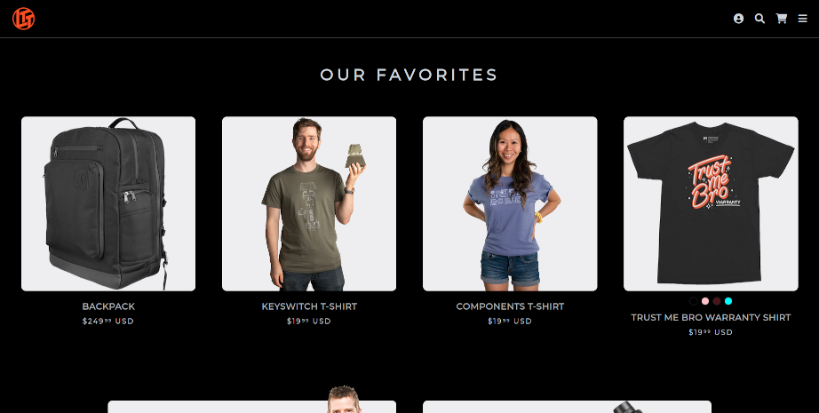

# lttstore-deep-dark
Dark mode userstyle for lttstore.com

This is a dark mode userstyle for the [Linus Tech Tips store](https://lttstore.com), and also contains fixes for a number of issues I encountered on the site.

You can install it using (preferrably) the [Stylus](https://add0n.com/stylus.html) extension, or you can also use the [Stylish](https://userstyles.org) extension.

## Examples

The theme uses a vibrant blue color for some links, and an off-white for most text. Almost anything actionable will turn LTT orange when you hover over it, and there are many LTT orange accents placed tastefully around. Here are some examples of the userstyle in action:

**The home page**

**The sidebar**

**Reviews**

**Cart**

## Fixes

There were a few style issues with the LTTStore site, so I took the liberty of fixing them to the best of my abilities while I was crawling the site CSS to create my userstyle.

### Fix image gallery navigation overflow on product pages

On product pages with a lot of images, the gallery navigation dots will overflow and run through the top of the page. To fix this, I used flex to rotate the nav horizontally and wrap the navigation dots with a consistent separation. With this fix, any number of images are supported, at the expense of a little headroom over the first image. There's only *so much* one can do through CSS.

**The issue**

**The fix**

### Fix missing color swatches for the LTT hat

On the main page, the color swatches for the LTT hat are missing.

**The issue**

**The fix**

